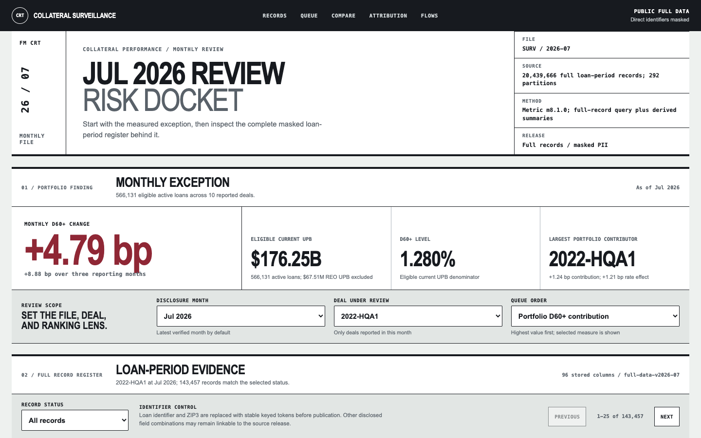

# Freddie Mac CRT Disclosure Analytics

Public full-record CRT collateral-surveillance workbench backed by the complete masked disclosure register and a versioned metric engine.

Status: the complete 20,439,666-row masked release and public query workbench are live. Hosted verification passed across the browser, Vercel query function, authenticated Cloudflare Worker, and private R2 assets. The prior P9 deployment is retained as the rollback target. No independent user study was performed.

[Open live dashboard](https://freddie-mac-crt-disclosure-analytic.vercel.app)



## What it does

- Processes complete approved Freddie Mac Clarity standard monthly archive: 292 files, 10 deals, 37 periods, and 20,439,666 loan-period rows.
- Ranks deals and reference-pool cohorts by transparent surveillance measures.
- Separates portfolio D60+ change into within-deal rate and portfolio-mix effects.
- Shows delinquency flows, outcomes, metric definitions, exclusions, and reconciliation evidence.
- Publishes every disclosed loan-period record and all 93 disclosure fields through deal-month filtering and pagination.
- Replaces loan identifier and ZIP3 with stable keyed tokens before publication; the key, raw archive, and local paths remain private.
- Keeps portfolio, deal, and pool summaries as navigation over the full record evidence.

## Architecture

Python validates explicit 89/90/93-field layouts and writes restricted partitioned Parquet. An offline DuckDB build preserves every row and replaces direct identifiers before creating 292 masked Parquet assets. The production serving design stores those immutable assets in a private Cloudflare R2 bucket. A GET-only Worker authenticates the Vercel function and exposes one validated partition at a time. The public function then applies bounded filters and pagination. The browser never receives an object-storage URL or service credential.

See [architecture](docs/architecture.md), [scope](docs/scope.md), and [metric glossary](docs/metric-glossary.md).

## Evaluation

- Full restricted foundation: 20,439,666 rows across 292 partitions.
- Shared public/private Current UPB, D30+, and D60+ variance: zero.
- Maximum D60+ decomposition identity variance: below 0.01 bp gate.
- Full metric refresh: 63.402 seconds on verified local machine.
- Common warm watchlist query: 1.23 ms.
- M12 keyed partition scan: 1 of 292 files; full-history column scan: 214.706 ms.
- M12 materialized metric query p95: 0.588 ms across 20 local runs.
- Public projection: 305,060 bytes.
- Public full-record release: 20,439,666 rows, 292 partitions, 96 stored columns including 93 disclosure fields, and zero invalid identifier tokens in the complete-row scan.
- Local public LCP/FCP: 68/68 ms; CLS: 0.
- Axe WCAG A/AA violations: zero, with manual contrast resolution.
- P9 review-docket redesign: zero horizontal overflow at 390 px, real keyboard-operable deal controls, and dedicated mobile chart geometry.
- Current automated tests: run locally; do not treat stale counts as release evidence.

M11 technical gate passes. Independent review remains `0/5` and is not a completion requirement after owner-approved scope revision. No independent, representative, or user-tested usability claim is made.

See [full-record release evaluation](evaluation/full-record-public-release.md), [M11 evaluation](evaluation/m11-usability-quality-controls.md), [M12 evaluation](evaluation/m12-scaled-local-hardening.md), [P7 hosted verification](evaluation/p7-hosted-candidate-verification.md), [P9 redesign evaluation](evaluation/p9-dashboard-redesign.md), and [optional independent-review protocol](docs/m11-representative-review-protocol.md).

## Run locally

Install dependencies and build public candidate:

```bash
uv sync
uv run python scripts/build_public_projection.py
openssl rand -out data/restricted/public-mask.key 32
uv run python scripts/build_public_full_data.py
uv run python scripts/build_release.py
uv run python scripts/serve_demo.py --port 8010
```

Open `http://127.0.0.1:8010/`.

Run private workbench only with approved restricted metric DB present:

```bash
uv run python scripts/serve_private_workbench.py --port 8011
```

Run tests:

```bash
UV_CACHE_DIR=/private/tmp/freddie-mac-crt-uv-cache \
  .venv/bin/python -m unittest discover -s tests -v
```

Create the masking key only once and retain it outside version control. Source intake and full-data commands are documented in [real-data intake](docs/real-data-intake.md) and [private workbench runbook](docs/private-workbench-runbook.md). Raw disclosure files and the masking key remain ignored and local.

Run append-only scaled-local refresh only with approved cumulative archive:

```bash
.venv/bin/python scripts/run_scaled_local_refresh.py data/restricted/<approved-archive>.zip
```

See [scaled-local operations](docs/scaled-local-operations.md).

## Limits

- Descriptive transaction surveillance, not investment advice or borrower-level lending system.
- No underwriting, pricing, servicing, marketing, consumer scoring, re-identification, or outside-data matching.
- Masked disclosure rows may remain linkable to the original source through combinations of non-identifier fields.
- No tranche/waterfall, yield, spread, forecasting, or causal claims.
- Actual Loss trend unavailable because July 2026 is first archive period with applicable field.
- Hosted verification covers Chromium, HTTP content parity, and production headers. Firefox, Safari, assistive-technology sessions, and field-vitals remain unverified.
- Portfolio-site application remains separately gated.

## Scaling

Current restricted baseline uses DuckDB and partitioned Parquet because workload is analytical, local, single-user, and more than 20 million rows. M12 verifies append-only refresh, one-file partition pruning, interrupted-run recovery, 12-run manifest retention, unchanged-history checks, and measured capacity.

The serving boundary uses private object storage instead of repository assets. It avoids coupling data retention to source-code publication and leaves roughly ten times the free storage headroom of the rejected Vercel Blob option. R2 SQL and a persistent analytical database remain unnecessary until measured latency, concurrency, or query-shape evidence justifies them. New provisioning, upload, deployment, or paid spend requires explicit owner approval.
