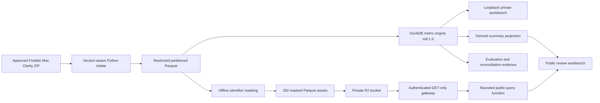

# Architecture

## Decision path

## Components

- Intake validates every accepted standard monthly row against explicit 89, 90, or 93-field layout and preserves source lineage.
- Restricted foundation stores 20,439,666 loan-period rows in 292 ZSTD Parquet partitions.
- DuckDB semantic layer calculates exposure, delinquency, transition, outcome, modification, risk-mix, and exact D60+ rate/mix decomposition.
- Private service binds to loopback, opens read-only DB connections, validates filters, defers row queries, and masks identifiers by default.
- Public data builder preserves all 20,439,666 rows and 93 disclosure fields, adds three lineage columns, and replaces loan identifier and ZIP3 with stable keyed tokens.
- Private R2 storage owns the immutable masked Parquet objects. It has no public bucket endpoint.
- Data gateway accepts authenticated GET requests for one exact release and asset-name pattern. It cannot list the bucket, write objects, or serve arbitrary paths.
- Public function validates deal, month, status, page size, and offset; authenticates to the gateway; downloads at most one masked Parquet asset; and returns at most 50 records with every stored field.
- Client release contains HTML, CSS, JavaScript, security-header policy, the derived summary projection, and the bounded Python function. It contains no Parquet assets or service credential.

## Trust boundaries

Raw files, original loan identifiers, original ZIP3 values, the masking key, local paths, metric DB, storage URLs, and service credentials stay outside Git and browser assets. The private R2 objects contain the complete disclosure rows after identifier masking. The unauthenticated query surface exposes bounded pages, not direct bulk object access. Because other field combinations may remain linkable to the source disclosure, re-identification and outside-data matching are prohibited. Product supports investigation, not lending or investment decisions.

## Scaling

Current full refresh is 63.402 seconds. M12 append-only runner reads cumulative archive inventory, stages only unseen deal-period partitions, recomputes rolling metric window, verifies historical tables remain unchanged, and records restricted recovery journal. Keyed scan reads 1 of 292 files, full-history identifier-column scan takes 214.706 ms, and common materialized query p95 is 0.588 ms on verified local machine. Hosted DB/API remains documentary alternative until measured refresh, query, storage, concurrency, or scheduling trigger is crossed.
