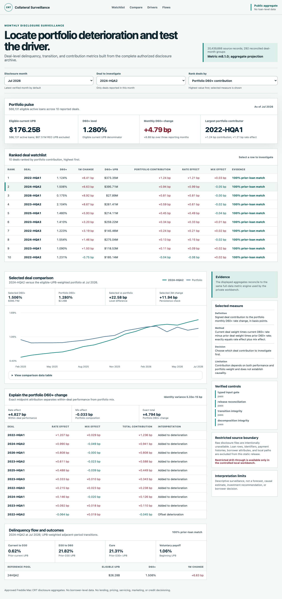

# P7 hosted candidate verification

Status: **complete on 2026-08-13**.

## Outcome

The reviewed M13 aggregate-only candidate is live at [freddie-mac-crt-disclosure-analytic.vercel.app](https://freddie-mac-crt-disclosure-analytic.vercel.app). The exact authenticated preview was promoted to Vercel production using existing free capacity.

## Verification

| Check | Result | Status |
| --- | --- | --- |
| Production state | Vercel target `production`, status `Ready` | Pass |
| Public reachability | Root returns HTTP 200 | Pass |
| Artifact parity | Hosted HTML, CSS, JavaScript, and aggregate JSON match approved local artifacts exactly | Pass |
| Aggregate boundary | Classification is `approved-aggregate-projection`; public release flag is true | Pass |
| Restricted manifest | `/manifest.json` returns HTTP 404 | Pass |
| Security policy | CSP, HSTS, frame denial, MIME sniffing denial, referrer, permissions, and cross-origin headers present | Pass |
| Browser behavior | Chromium loaded July 2026, changed deal to `2024-HQA2`, updated comparison, and showed no error state | Pass |
| Static error scan | No runtime error logs found; release has no server function or runtime API | Pass |
| Incremental cost | Existing free Vercel capacity, actual incremental cost $0.00 | Pass |

## Visual evidence

## Rollback

The previously READY production deployment and exact rollback command are retained in the private operations record. No rollback was required.

## Limits

- Hosted browser coverage is Chromium only.
- Firefox, Safari, assistive-technology sessions, field-vitals, and representative-user testing remain unverified.
- Repository publication, push, portfolio-site application, new cloud resources, and paid spend were not authorized or performed.
