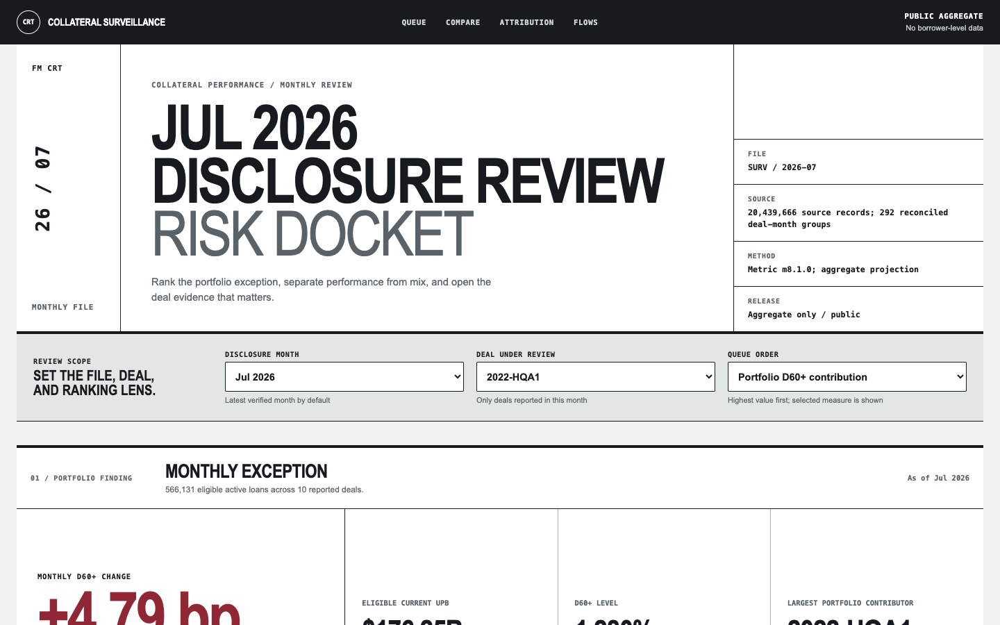
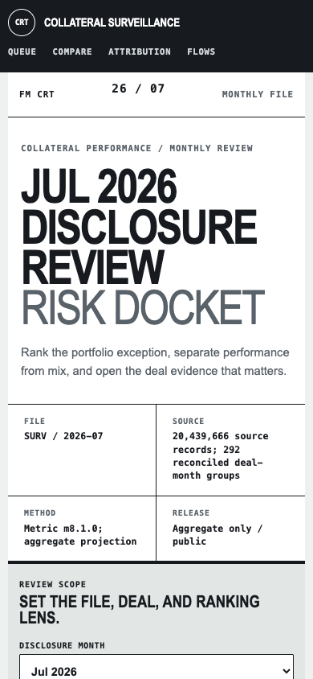

# P9 dashboard redesign evaluation

Status: **complete on 2026-08-18**.

## Decision

The redesigned aggregate-only public twin passed local and hosted release verification and is live at [freddie-mac-crt-disclosure-analytic.vercel.app](https://freddie-mac-crt-disclosure-analytic.vercel.app). It is framed as a monthly risk-committee review docket rather than a generic analytics template.

## Design assessment

| Review question | Result | Status |
| --- | --- | --- |
| Does the opening identify a specific job and file? | Month, file, source coverage, metric version, boundary, and review task appear before the queue | Pass |
| Does the visual system belong to the domain? | Filed-sheet structure, numbered sections, registration rules, review marks, and evidence stamps support committee review | Pass |
| Are generic dashboard patterns reduced? | No marketing hero, gradient, glass treatment, rounded card grid, decorative illustration, or interchangeable feature tiles | Pass |
| Is the analytical chain preserved? | Exception, ranked deal queue, relative performance, attribution, flow, and evidence remain in one sequence | Pass |
| Is the public boundary explicit? | Aggregate-only and no-borrower-level copy remain visible; restricted drill-through remains local | Pass |

## Browser evidence

| Gate | Result | Status |
| --- | --- | --- |
| Desktop viewport | 1440 by 900 Chromium screenshot reviewed | Pass |
| Mobile viewport | 390 by 844 Chromium screenshot reviewed | Pass |
| Horizontal overflow at 390 px | None | Pass |
| Mobile trend geometry | Dedicated 360 by 220 view box with reduced label density | Pass |
| Deal selection | Real button, current state announced with `aria-pressed`, Enter activates selection | Pass |
| Automated WCAG A/AA violations | 0 desktop, 0 mobile | Pass |
| Contrast resolution | Manual color pairs remain above AA; axe incompletes are SVG and overflow-table background inference | Pass |
| Local TTFB / FCP / LCP / CLS | 0.4 ms / 60 ms / 60 ms / 0.02 | Pass |
| Console and page errors | None observed | Pass |

## Hosted verification

| Gate | Result | Status |
| --- | --- | --- |
| Production state | Vercel target `production`, status `Ready` | Pass |
| Public reachability | Root and all four public assets return HTTP 200 | Pass |
| Artifact parity | Production HTML, CSS, JavaScript, and aggregate JSON match the verified local release exactly | Pass |
| Restricted manifest | `/manifest.json` returns HTTP 404 | Pass |
| Security policy | CSP, HSTS, frame denial, MIME sniffing denial, referrer, permissions, and cross-origin headers present | Pass |
| Browser behavior | Chromium changed the selected deal to `2024-HQA2`; state and URL updated without an error | Pass |
| Hosted accessibility | 0 automated WCAG A/AA violations | Pass |
| Incremental cost | Existing free Vercel capacity, actual incremental cost $0.00 | Pass |

## Screenshots

Desktop review docket:

Mobile review docket:

Promoted production docket:

## Scope

This evaluation verifies the redesigned interface and static release boundary. It does not add an independent user study, cross-browser claim, assistive-technology session, field-vitals claim, forecasting, causal attribution, or borrower-level capability.

The owner accepted existing M12 local scaling evidence for P8 and approved P9 repository publication after redesign and release verification. Portfolio-site application remains separately gated.
